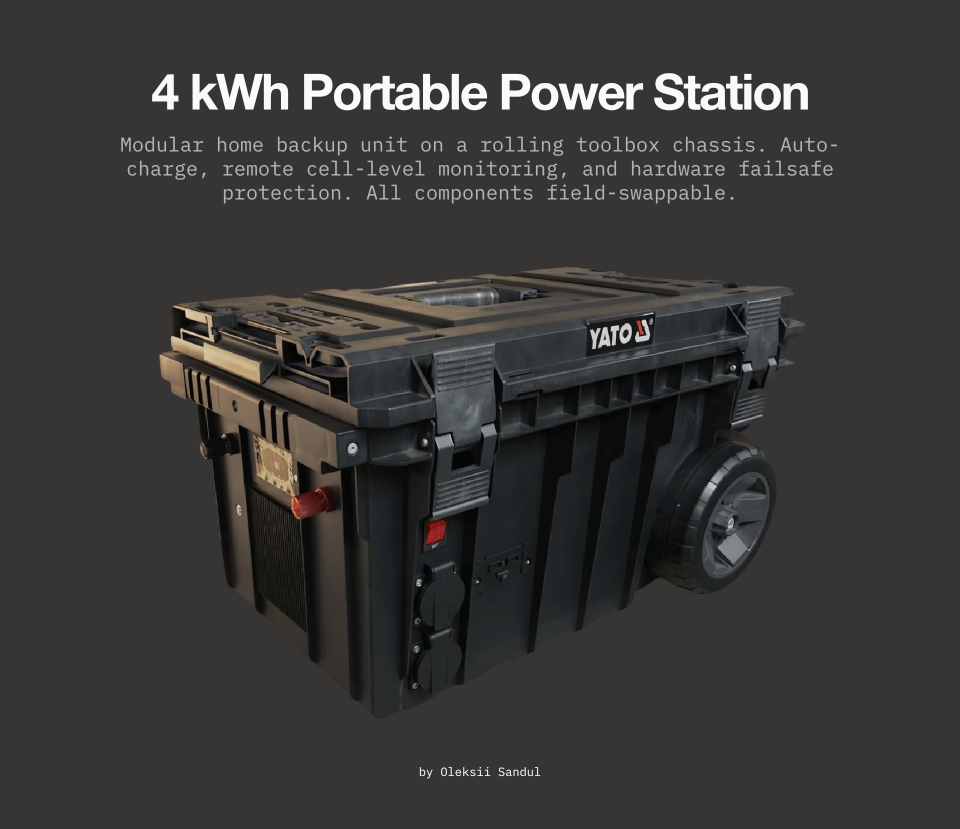

# Portable Power Station 4 kWh — Home Backup & Off-Grid Power

A self-built 4 kWh LiFePO4 portable power station designed for home backup during power outages and for mobile off-grid use. The unit is housed in a wheeled toolbox, connects to the home breaker panel as a reserve power source, and can be taken off-site when needed.

  

## 🧩 Why I Built It Instead of Buying

With standard off-the-shelf power stations, the failure of a single component—like the circuit board or lithium battery—means relying on specialized service centers, where spare parts may be unavailable and repairs can drag on for days. When winter outages stretch up to 14 hours and your home is left without backup power and heating, time is everything. I designed this station from the ground up with **fully swappable components**:

- **LiFePO4 cells** —  Unsoldered element contacts make individual cells simple to replace.

- **BMS** —  A JK BMS that can be upgraded entirely without rewiring the pack.

- **Inverter** —  A standard, affordable inverter that can be quickly swapped out.

- **Charger** —  A reliable, server-grade charger that is easily replaceable or upgradable.

- **Top-mounted modular bays** —  The toolbox lid accommodates additional stacked cases for housing a larger inverter or a second charger.

This modular approach allows for repairing, upgrading, or reconfiguring any subsystem in the field using basic hand tools. No proprietary connectors, no glued enclosures, and no planned obsolescence.

## ⚡ Specifications

| Parameter | Value |
|-----------|-------|
| Battery Chemistry | LiFePO4 |
| Capacity | 4 kWh |
| Nominal Voltage | 12 V |
| Max Continuous Discharge | 200 A (via JK BMS) |
| Inverter | 1500 W pure sine wave |
| Charger | Server-grade 12 V 40 A |
| Monitoring | ESP32 + ESPHome → Home Assistant (Wi-Fi) |
| Automation | Home Assistant + Zigbee devices |
| Housing | Portable wheeled toolbox (YATO) |

---

## 🔧 Components

- **Battery Cells:** *Cornex 3,2V lifepo4 314Ah Grade A × 4*
- **BMS:** Jikong JK-B2A8S20P (200 A, active balance, BLE, RS485)
- **Inverter:** TATALIKEN 3000 W pure sine wave
- **Charger:** Server-grade 12 V 40 A
- **Monitoring:** ESP32 DevKit + ESPHome integration + JK BMS LCD 3.2
- **Hardware Protection XH-M602:** Dedicated charge cutoff board — automatically stops charging when cell voltage
- **Adjustable PSU Module DC-DC 10А 600W 10V-60V 12-60V:** Configurable output voltage, currently set to 19 V
- **Cooling:** For cooling, I used two 120mm fans connected to a relay with a temperature sensor. You can manually set the temperatures at which the fans turn on and off.
- **Home Panel Integration:** Two cables to the breaker panel — one for backup power feed, one for grid charging when electricity is available
- **Automation:** Home Assistant with Zigbee sensors and switches, ESP32 and DC-DC LM2596 3A 4.5-40V

---

## 🏠 Home Integration & Automation

The station connects to the home electrical panel via **two dedicated cables:**

1. **Backup Power Cable** — feeds the house panel when grid power is lost.
2. **Grid Charge Cable** — charges the station automatically when grid power returns.

All switching is automated through **Home Assistant** with Zigbee devices:
- Automatic switchover to backup when grid goes down
- Automatic charging start when grid is restored
- Remote monitoring of battery state, power flow, and temperature

**Failsafe Protection:** A hardware charge cutoff board is installed as a secondary safety layer. If the Home Assistant automation fails, the board physically disconnects the charger once the battery reaches the configured voltage limit.

---

## 🔌 Outputs

| Output | Quantity | Connector / Notes |
|--------|----------|-------------------|
| 220 V AC | 2 | Pure sine wave via inverter |
| USB | 2 | Standard USB ports |
| 12 V DC | 2 | XT60 |
| Adjustable DC | 2 | XT60, currently set to 19 V (via adjustable PSU module) |

---

## 📊 Monitoring

The ESP32 transmits **dozens** of different data points to Home Assistant. I selected the ones most important to me and displayed them on the dashboard.

Real-time battery monitoring via ESP32 + ESPHome:

- Total and per-cell voltage
- Charge / discharge current
- Power (W)
- Cell and BMS temperature

More screenshots of JK BMS settings and Home Assistant dashboard are included in the `images/` folder.

---

## 📐 Wiring Overview

## ⚠️ Safety & Disclaimer

> **WARNING:** This project involves high currents (up to 200 A), lithium batteries, and mains voltage integration. Improper assembly or wiring can cause fire, explosion, electric shock, or damage to home electrical systems. This repository is for educational purposes only. Always use proper BMS, fuses, circuit breakers, and certified hardware cutoff protection. Replicate at your own risk.

---

## 📸 Gallery

| Stage | Image |
|-------|-------|
| Front view — display active | `images/station_front.jpg` |
| Internal wiring and BMS | `images/internal_wiring.jpg` |
| ESP32 monitoring module | `images/bms_esp32.jpg` |
| Home Assistant dashboard | `images/homeassistant_dashboard.png` |
| JK BMS settings | `images/jk_bms_settings.png` |
